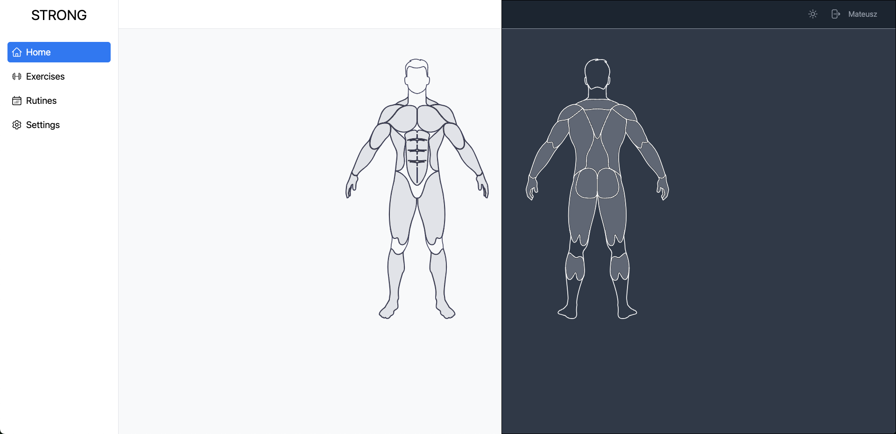
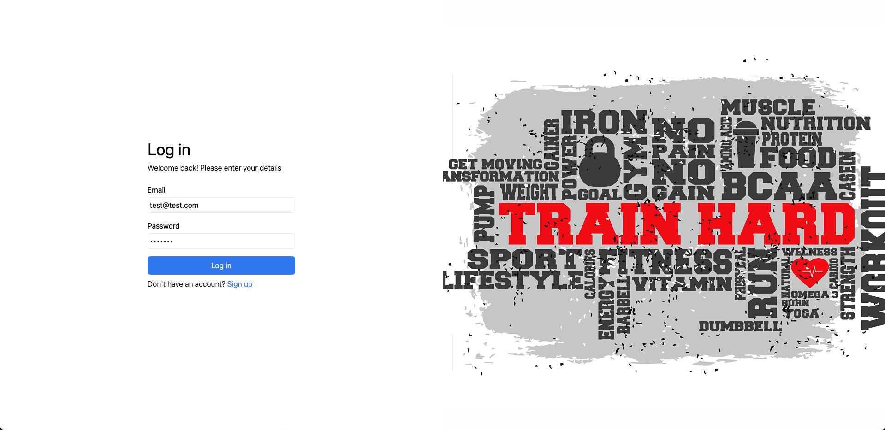
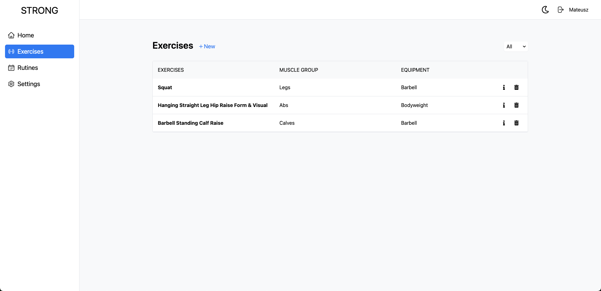
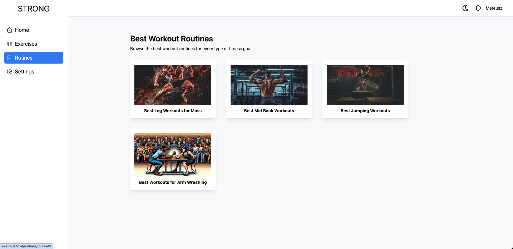
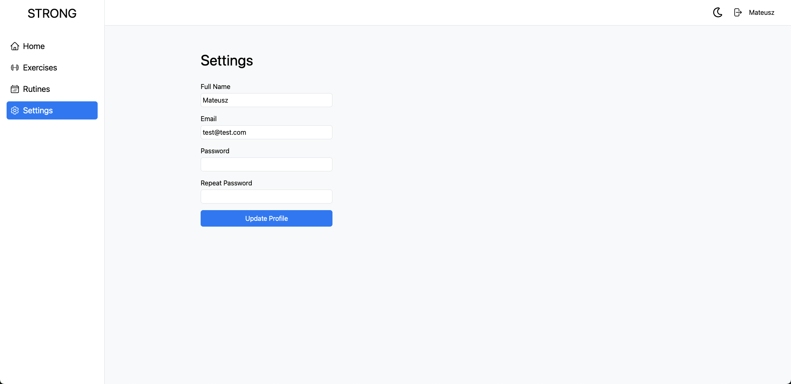

# The STRONG App

Welcome to STRONG!
Discover the details of our fitness app where you can add exercises and follow workout routines. STRONG helps you stay organized and motivated on your fitness journey.

Interactive Muscle Map – Explore an interactive human body map to learn more about specific muscle groups. You can also edit and update information about each muscle.

# Live Site

Check out the live app here: [STRONG](https://strong-gamma.vercel.app/home)

# Key Feautures of STRONG

# Login page

Secure Access – Only verified accounts can log in. New users can easily register and verify their accounts to get started.

# Exercises page

Custom Exercise Library – Add new exercises to the database to build a comprehensive library of movements for your training needs.

# Rutines page

Workout Routine Browser – Browse a variety of pre-built training routines tailored to different goals and fitness levels.

# Settings page

Account Settings Management – Update your user information, including name, email, password, and other personal details at any time.

# Technologies Used

- React for the frontend.
- TypeScript is used throughout the app to ensure type safety, reduce bugs, and improve code maintainability during development.
- Supabase for the database and real-time data updates.
- React Query for data fetching and caching.
- React Router for navigation.
- React Hook Form for efficient form handling.
- Reduxto manage the state of the interactive human body map.
- Tailwind CSS for styling the UI, including dark mode.
- Vite for development environment and build system.
- React Toast is used for notifications.

# About the Project

This entire application was fully designed and developed by me — from concept and UI design to implementation and deployment. During the development process, I also learned how to work with TypeScript, improving the overall quality and reliability of the code.
